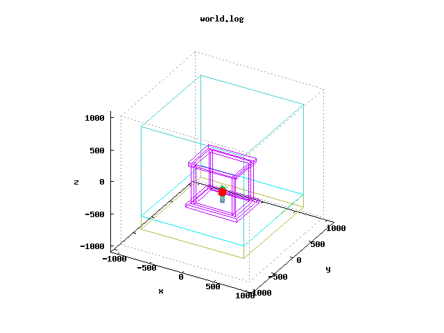
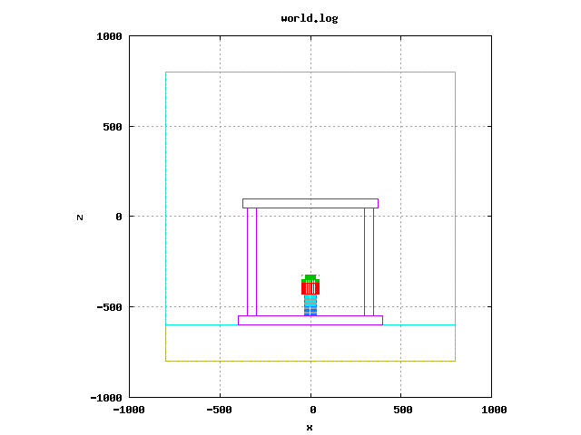
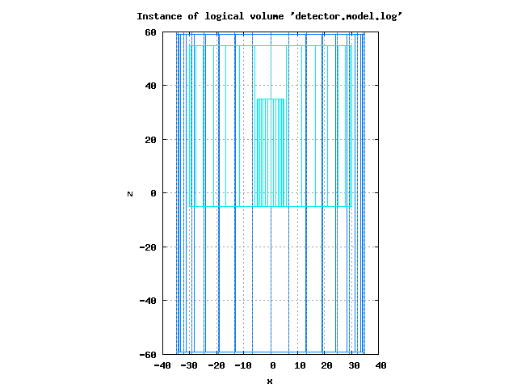
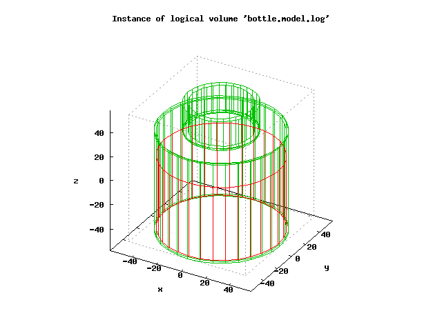
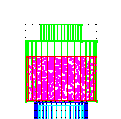
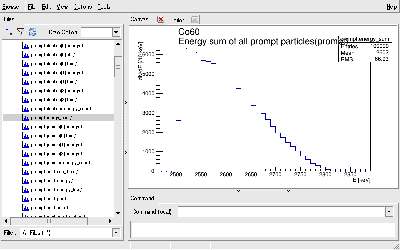
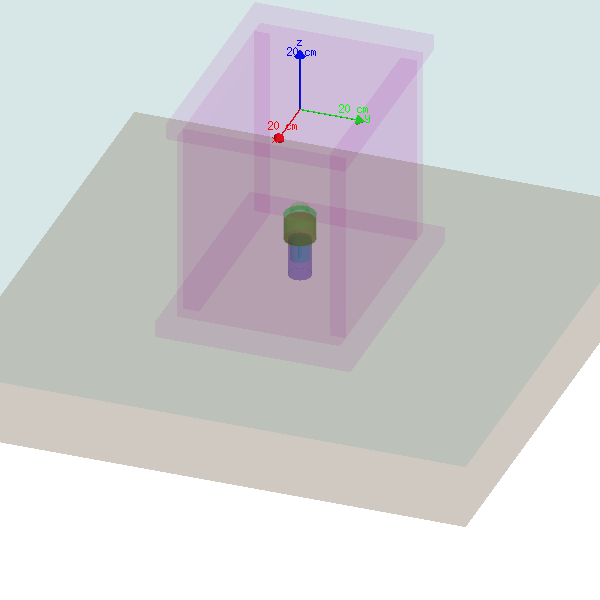
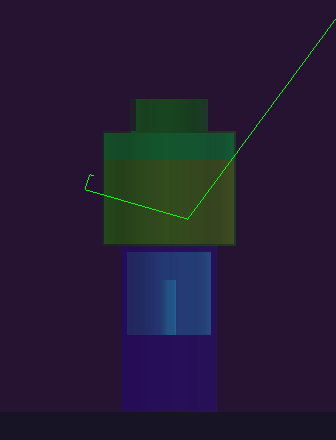
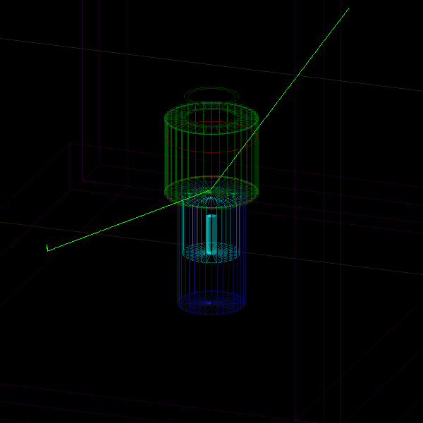

===========================================================
Bayeux/mxtools example ex03 : HPGe detector simulation
===========================================================

:Authors: - François Mauger, LPC Caen <mauger@lpccaen.in2p3.fr>
	  - Arnaud Chapon, Cerap <achapon@cerap.fr>
:Date: 2015-10-16

Introduction
============

This example modelizes the radioactivity  measurement of a sample with
a HPGe detector.  An application is also provided to  analyze the data
and  produce  the  energy  spectrum  takig  into  account  the  energy
resolution and detection threshold of the HPGe detector.

Prerequisite
============

Make sure the following software is available on your system:

* cmake
* g++
* python-docutils
* gnuplot
* Bayeux (and Cadfael)

Preparation
===========

Make sure Bayeux is installed and setup in your shell environment. The
following command should work:

.. code:: sh

   $ bxquery --version

Define the  environment variable ``HPGE_RESOURCES_DIR`` and  set it to
the resource files base directory of the project:

.. code:: sh

   $ cd {this example base directory}
   $ export HPGE_RESOURCES_DIR="$(pwd)/resources"

Create a working directory to store Monte-Carlo files (data and management):

.. code:: sh

   $ export HPGE_WORK_DIR="/tmp/${USER}/mctools.ex03.d/HPGe"
   $ mkdir -p ${HPGE_WORK_DIR}
   $ mkdir -p ${HPGE_WORK_DIR}/data
   $ mkdir -p ${HPGE_WORK_DIR}/management

Geometry
========

Display and inspect the geometry:

.. code:: sh

   $ bxgeomtools_inspector \
       --manager-config "${HPGE_RESOURCES_DIR}/config/HPGe/geometry/0.1/manager.conf" \
       --with-visu --visu-view-3d

   The 3D view of the setup

   The XZ view of the setup

   The XZ view of the detector

   The 3D view of the bottle

Vertex generation
=================

List the available vertex generators:

.. code:: sh

   $ bxgenvtx_production \
       --geometry-manager "${HPGE_RESOURCES_DIR}/config/HPGe/geometry/0.1/manager.conf" \
       --vertex-generator-manager "${HPGE_RESOURCES_DIR}/config/HPGe/simulation/vertexes/0.1/manager.conf" \
       --list

Generate and display  some randomize vertexes from the  bulk volume of
the measured sample:

.. code:: sh

   $ bxgenvtx_production \
       --geometry-manager "${HPGE_RESOURCES_DIR}/config/HPGe/geometry/0.1/manager.conf" \
       --vertex-generator-manager "${HPGE_RESOURCES_DIR}/config/HPGe/simulation/vertexes/0.1/manager.conf" \
       --shoot --prng-seed 314159 \
       --number-of-vertices 1000 \
       --vertex-generator "sample_bulk.vg" \
       --output-file "/tmp/vertices.data" \
       --visu \
       --visu-spot-zoom 0.25

   The XZ view of the vertexes generated in the sample

Generation of primary particles
===============================

List the available vertex generators:

.. code:: sh

   $ bxgenbb_inspector \
	  --configuration "${HPGE_RESOURCES_DIR}/config/HPGe/simulation/primaries/0.1/manager.conf" \
	  --action "list"

Generate some randomize primary decay events and build histograms:

.. code:: sh

   $ bxgenbb_inspector \
	  --configuration "${HPGE_RESOURCES_DIR}/config/HPGe/simulation/primaries/0.1/manager.conf" \
	  --action "shoot" \
	  --generator "Co60" \
	  --prng-seed 314159 \
	  --number-of-events 10000 \
	  --modulo 1000 \
	  --histo-def "@genbb_help:inspector/config/le_nuphy-1.0/inspector_histos_prompt.conf" \
	  --prompt \
	  --title-prefix "Co60" \
	  --output-file "${HPGE_WORK_DIR}/data/histos_Co60.root"

Open a Root interactive session:

.. code:: sh

   $ root histos_Co60.root
   root [0]
   Attaching file histos_Co60.root as _file0...
   root [1] TBrowser b;

and browse some histograms of interest.

   The distribution of the total energy of all generated particles in the Co-60 decay.

.. code:: sh

   root [2] .q

Run a Geant4 simulation
=======================

Run an interactive simulation:

.. code:: sh

   $ bxg4_production \
	  --interactive \
	  --g4-visu \
	  --g4-macro "${HPGE_RESOURCES_DIR}/config/HPGe/simulation/geant4_control/0.1/geant4_visualization.macro" \
	  --config "${HPGE_RESOURCES_DIR}/config/HPGe/simulation/geant4_control/0.1/manager.conf" \
	  --vertex-generator-name "sample_bulk.vg" \
	  --vertex-generator-seed 314159 \
	  --event-generator-name "Co60" \
	  --event-generator-seed 314159 \
	  --g4-manager-seed 314159 \
	  --shpf-seed 314159 \
	  --number-of-events-modulo 1 \
	  --output-prng-seeds-file  "${HPGE_WORK_DIR}/management/mc_g4_production.seeds" \
	  --output-prng-states-file "${HPGE_WORK_DIR}/management/mc_g4_production.states" \
	  --output-data-file "${HPGE_WORK_DIR}/data/mc_g4_sample.xml"
   Idle>

   The 3D rendering of the setup in Geant4.

Run 5 decays:

.. code:: sh

   Idle> /run/beamOn 5
   Idle> exit

   The XZ rendering of one Co-60 decay in Geant4

   The 3D rendering of one Co-60 decay in Geant4

Check the output files:

.. code:: sh

   $ LANG=C tree ${HPGE_WORK_DIR}/
   /tmp/mauger/mctools/work/
   |-- data
   |   `-- mc_g4_sample.xml
   `-- management
       |-- mc_g4_production.seeds
       `-- mc_g4_production.states

Run a batch simulation:

.. code:: sh

   $ bxg4_production \
	  --config "${HPGE_RESOURCES_DIR}/config/HPGe/simulation/geant4_control/0.1/manager.conf" \
	  --vertex-generator-name "sample_bulk.vg" \
	  --vertex-generator-seed 314159 \
	  --event-generator-name "Co60" \
	  --event-generator-seed 314159 \
	  --g4-manager-seed 314159 \
	  --shpf-seed 314159 \
	  --number-of-events 100000 \
	  --number-of-events-modulo 1000 \
	  --forbid-private-hits --dont-save-no-sensitive-hit-events \
	  --output-prng-seeds-file  "${HPGE_WORK_DIR}/management/mc_g4_production.seeds" \
	  --output-prng-states-file "${HPGE_WORK_DIR}/management/mc_g4_production.states" \
	  --output-data-file "${HPGE_WORK_DIR}/data/mc_g4_sample.data.gz" \
	  > ${HPGE_WORK_DIR}/management/mc_g4_production.log

Run the analysis program:

.. code:: sh

    ${HPGE_INSTALL_DIR}/bin/hpge_analysis  \
    	--logging-priority "notice" \
    	--input-file "${HPGE_WORK_DIR}/data/mc_g4_sample.data.gz" \
	--prng-seed=12345 \
	--histo-output-file "${HPGE_WORK_DIR}/data/histo_spectro.data \
    	--histo-draw
